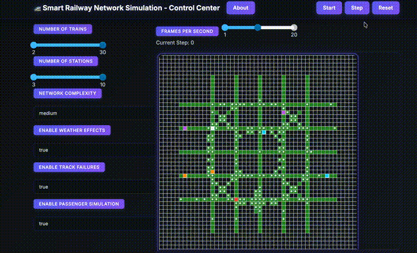
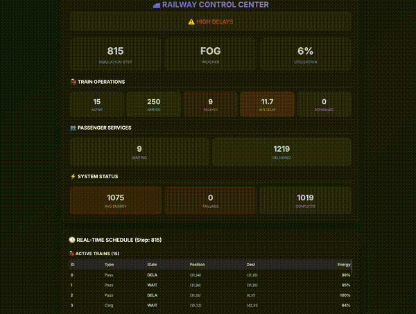
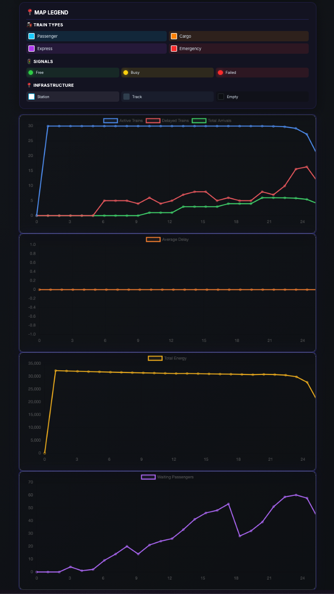

# 🚄 Smart Railway Network Simulator

A comprehensive multi-agent railway network simulation built with **MESA** (Multi-agent Ecosystem for Simulation and Analysis). This project simulates a realistic railway system with intelligent trains, dynamic signals, centralized dispatching, passenger management, and real-time analytics.

<p align="center">
  
</p>

### Live Statistics Dashboard
Real-time monitoring of train operations, delays, energy consumption, and passenger metrics:

<p align="center">
  
</p>

### Analytics & Visualization
Comprehensive post-simulation analysis with detailed graphs:

<p align="center">
  
</p>

---

## ✨ Features

### 🚂 Multiple Train Types
| Type            | Priority | Speed     | Use Case           |
| --------------- | -------- | --------- | ------------------ |
| 🔵 **Passenger** | Medium   | Fast      | Commuter transport |
| 🟠 **Cargo**     | Low      | Slow      | Freight hauling    |
| 🟣 **Express**   | High     | Very Fast | Premium service    |
| 🔴 **Emergency** | Highest  | Fast      | Emergency response |

### 🎯 Core Simulation Components
- **TrainAgent**: Autonomous trains with A* pathfinding, energy management, and state tracking
- **SignalAgent**: Track access control with priority-based management
- **DispatcherAgent**: Central coordination, rerouting, and conflict resolution
- **StationAgent**: Passenger management and boarding operations
- **PassengerAgent**: Individual passenger simulation

### 🌍 Dynamic Environment
- **Weather System**: Clear, Rain, Storm, Fog, Snow (affects train speed)
- **Track Failures**: Random failures requiring automatic rerouting
- **Maintenance**: Energy management and refueling at stations
- **Real-time Adaptation**: Trains adapt to changing conditions

### 📊 Advanced Analytics
- Energy consumption tracking
- Delay monitoring and statistics
- Passenger flow analysis
- Network utilization metrics

---

## 🚀 Quick Start

### Prerequisites
- Python 3.8+
- pip

### Installation

```bash
# Clone the repository
git clone https://github.com/yourusername/smart-railway-network-simulation.git
cd smart-railway-network-simulation

# Create virtual environment
python -m venv venv
source venv/bin/activate  # On Windows: venv\Scripts\activate

# Install dependencies
pip install -r requirements.txt
```

### Run the Simulation

```bash
# Launch interactive visualization
python run.py

# Open browser to http://127.0.0.1:8521
```

---

## 🎮 Usage

### Interactive Mode (Default)
```bash
python run.py
```
Opens a web-based visualization at `http://127.0.0.1:8521`

### Batch Mode
```bash
# Run without visualization
python run.py --batch --steps 1000 --trains 20 --stations 8

# Custom configuration
python run.py --batch --complexity complex --no-weather
```

### Comparative Analysis
```bash
python run.py --compare
```

### Command-Line Options
```
--batch              Run without visualization
--compare            Run comparative analysis
--steps N            Simulation steps (default: 500)
--trains N           Number of trains (default: 10)
--stations N         Number of stations (default: 5)
--complexity LEVEL   Network: simple, medium, complex
--no-weather         Disable weather effects
--no-failures        Disable track failures
--no-passengers      Disable passenger simulation
```

---

## 🏗️ Architecture

```
smart-railway-network-simulation/
├── agents.py           # All agent classes (Train, Signal, Station, etc.)
├── model.py            # Main simulation model
├── visualization.py    # MESA visualization and plotting
├── run.py              # Entry point and CLI
├── requirements.txt    # Dependencies
├── assets/             # Media files
│   ├── map_trains_realtime.gif
│   ├── stats_real_time.gif
│   └── graphs.png
└── README.md
```

### Agent Hierarchy
```
RailwayNetworkModel
├── DispatcherAgent (singleton)
├── TrainAgent (multiple)
│   ├── Passenger, Cargo, Express, Emergency
├── SignalAgent (at junctions)
├── StationAgent (strategic locations)
└── PassengerAgent (optional)
```

---

## 📈 Key Algorithms

| Algorithm               | Purpose                                      |
| ----------------------- | -------------------------------------------- |
| **A* Pathfinding**      | Optimal route finding through network        |
| **Priority Management** | Higher priority trains can request rerouting |
| **Conflict Resolution** | Dispatcher manages track junction conflicts  |
| **Dynamic Rerouting**   | Automatic rerouting around failures          |
| **Energy Optimization** | Balance speed vs energy consumption          |

---

## 🔬 Educational Value

This project demonstrates:
- **Multi-agent systems** with autonomous decision-making
- **Emergent behavior** from simple rules
- **Resource management** (track allocation, energy)
- **Priority scheduling** with competing objectives
- **Real-time adaptation** to failures and changes
- **Data visualization** and analytics

---

## 🤝 Contributing

Contributions welcome! Areas for improvement:
- Performance optimization
- More realistic train physics
- Additional agent types
- Machine learning integration
- Reinforcement learning dispatcher

---

## 📝 License

MIT License - Feel free to use, modify, and extend.

---

## 🙏 Acknowledgments

Built with:
- **[MESA](https://mesa.readthedocs.io/)** - Multi-agent simulation framework
- **[NetworkX](https://networkx.org/)** - Graph algorithms
- **[Matplotlib](https://matplotlib.org/)** - Visualization
- **[Pandas](https://pandas.pydata.org/)** - Data analysis

---

<p align="center">
  <strong>Happy Simulating! 🚄✨</strong>
</p>
</CodeContent>
<parameter name="EmptyFile">false
